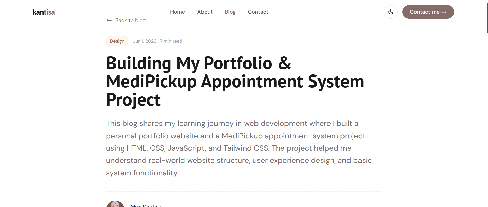
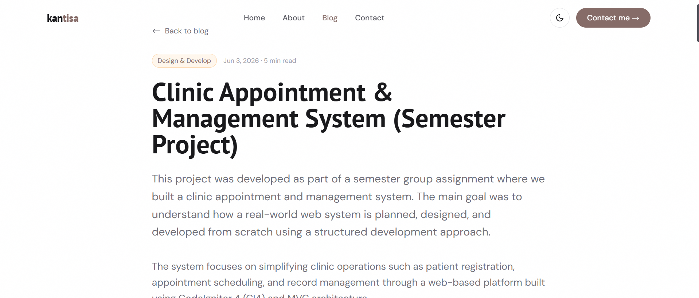
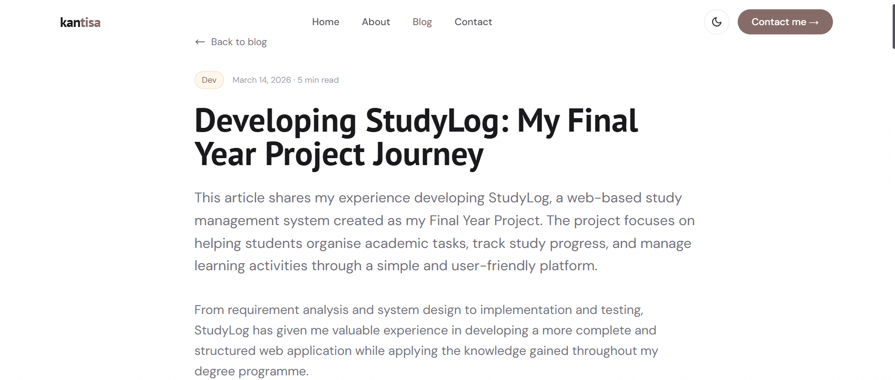

```md
# Personal Blog Portfolio

## Description

This project is a personal blog website developed as part of a web development assignment. The purpose of this project is to demonstrate understanding of basic front-end development, UI/UX design, and responsive web design.

The website allows users to view blog posts, read full articles, and navigate through different sections such as Home, About, Blog, and Contact. It is designed with a clean and modern interface to improve user experience.

---

## Features

- Home page with personal introduction
- About page describing background and learning journey
- Blog page with 2–3 sample blog posts
- Blog article detail page
- Contact section with form layout
- Responsive design for mobile and desktop
- Dark mode interface
- Smooth navigation between pages

---

## Technologies Used

- HTML5
- CSS3
- Tailwind CSS
- JavaScript
- Visual Studio Code
- Git
- GitHub

---

## Screenshots

### Home Page


### About Page


### Blog Page


### Blog Article Pages






### Contact Page


---

## How to Run the Project

1. Clone this repository:

git clone https://github.com/mkantisa/portfolio-kantisa.git

2. Open the project folder.

3. Open `index.html` in any web browser.

No additional installation is required because this is a static website project.

---

## Demo Link

Live Website:  
https://mkantisa.github.io/portfolio-kantisa/

---

## Repository Link

GitHub Repository:  
https://github.com/mkantisa/portfolio-kantisa

---

## Author

Miss Kantisa

Student Developer

---

## Note

This project was developed for academic purposes as part of the CSD34203 Special Topics in Software Development course. The project demonstrates understanding of front-end web development, responsive design, GitHub version control, and the software development process through planning, implementation, testing, and documentation.
```
