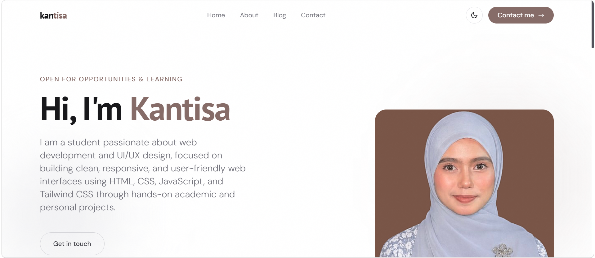
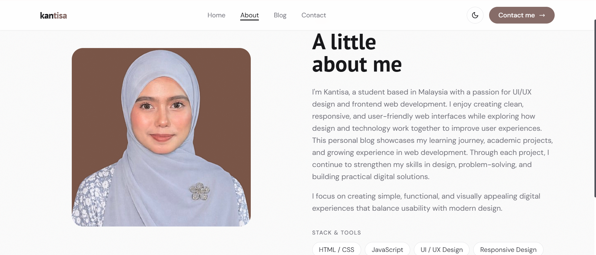
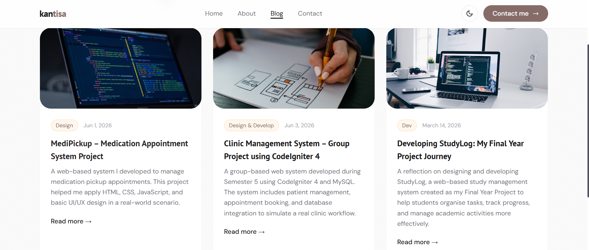
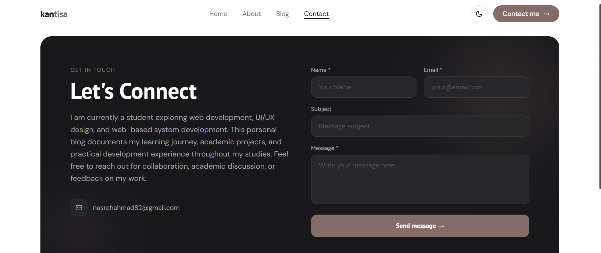

# Personal Blog Portfolio

## Description
This project is a personal blog website developed as part of a web development assignment. The purpose of this project is to demonstrate understanding of basic front-end development, UI/UX design, and responsive web design.

The website allows users to view blog posts, read full articles, and navigate through different sections such as Home, About, Blog, and Contact. It is designed with a clean and modern interface to improve user experience.

---

## Features
- Home page with personal introduction
- About page describing background and learning journey
- Blog page with 2–3 sample blog posts
- Blog article detail page
- Contact section with form layout
- Responsive design for mobile and desktop
- Dark mode interface
- Smooth navigation between pages

---

## Technologies Used
- HTML
- CSS
- Tailwind CSS
- JavaScript (basic interactions such as dark mode / animation)
- Visual Studio Code
- Git & GitHub for version control

---

## Screenshots

### Home Page


### About Page


### Blog Page


### Blog Article Page


### Contact Page


---

## How to Run the Project

1. Clone this repository:
```bash
git clone https://mkantisa.github.io/portfolio-kantisa/

---

## Demo Link
